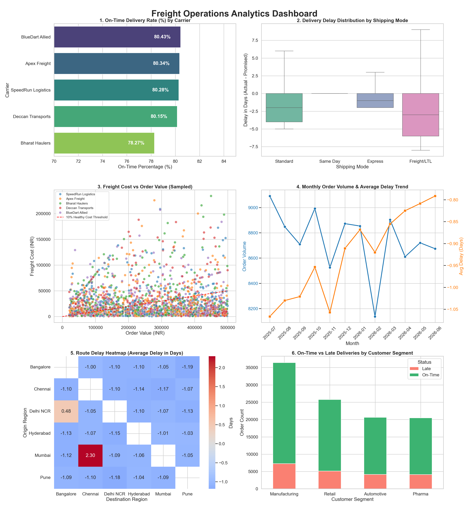

# Freight & Logistics Operations Analytics
### Business Analyst Portfolio Project

This repository showcases a comprehensive, end-to-end data analytics and business intelligence project tailored for a **Business Analyst** role in the freight and logistics tech startup sector. The project demonstrates business process understanding, data engineering and cleaning, SQLite relational database modeling, raw SQL querying, visual dashboarding, and the translation of structured analytical findings into a formal Business Requirement Document (BRD).

---

## 📂 Project Structure

- **[freight_analytics.py](file:///c:/Users/ak500/OneDrive/Desktop/IT/route_scopes/freight_analytics.py)**: The complete Python script implementing the data pipeline: synthetic generation, dirty data injection, pandas cleaning, SQLite loading, raw SQL execution, and Matplotlib/Seaborn visualization.
- **[freight_analytics.ipynb](file:///c:/Users/ak500/OneDrive/Desktop/IT/route_scopes/freight_analytics.ipynb)**: An interactive Jupyter Notebook version containing structured markdown cells, live code cells, SQL query outputs, and inline visual charts.
- **[BRD.md](file:///c:/Users/ak500/OneDrive/Desktop/IT/route_scopes/BRD.md)**: Standalone markdown version of the Business Requirement Document (BRD) outlining findings and recommendations.
- **[freight_orders_raw.csv](file:///c:/Users/ak500/OneDrive/Desktop/IT/route_scopes/freight_orders_raw.csv)**: The raw, dirty synthetic dataset (105,000 transaction rows).
- **[freight_orders_cleaned.csv](file:///c:/Users/ak500/OneDrive/Desktop/IT/route_scopes/freight_orders_cleaned.csv)**: The clean dataset after applying the cleaning pipeline (104,941 rows).
- **[freight_operations.db](file:///c:/Users/ak500/OneDrive/Desktop/IT/route_scopes/freight_operations.db)**: Local SQLite database containing the loaded cleaned transaction table.
- **[dashboard.png](file:///c:/Users/ak500/OneDrive/Desktop/IT/route_scopes/dashboard.png)**: Combined high-resolution multi-panel BI dashboard.
- **[panel_1_carrier_otd.png](file:///c:/Users/ak500/OneDrive/Desktop/IT/route_scopes/panel_1_carrier_otd.png)** through **[panel_6_segment_breakdown.png](file:///c:/Users/ak500/OneDrive/Desktop/IT/route_scopes/panel_6_segment_breakdown.png)**: Individual high-res visualization panels.
- **[LICENSE](file:///c:/Users/ak500/OneDrive/Desktop/IT/route_scopes/LICENSE)**: MIT License.

---

## 📊 Dataset & Cleaning Pipeline

The project utilizes a programmatically generated synthetic dataset of **105,000 rows** spanning a 12-month transaction window (July 2025 – June 2026). It simulates industrial freight movements between six major Indian cities (Mumbai, Delhi NCR, Bangalore, Chennai, Pune, Hyderabad) across four shipping modes and five carriers.

### Deliberate "Dirty" Data Injected:
1. **Chronological Anomalies (0.05%)**: Set actual delivery dates prior to the order placement dates.
2. **Missing Customer Segments (0.5%)**: Null customer classifications representing registration gaps.
3. **Physical Weight Outliers (0.1%)**: Unrealistic weight figures (up to 8,000,000 kg), simulating typing errors.
4. **Billing Surcharges Outliers (0.15%)**: Extreme freight bills (up to ₹10,000,000).
5. **Sign Typo Errors (0.15%)**: Freight costs written as negative values.
6. **Missing Transaction Logs (1.0% - 1.5%)**: Null freight costs and null delivery dates (transit/in-progress logs).

### Implemented Cleaning Pipeline (Pandas):
- **Date Check**: Rows with illogical dates (`actual_delivery_date < order_date`) are flagged and dropped.
- **Segment Imputation**: Imputed missing `customer_segment` values using the mode (`Manufacturing`).
- **Weight Cap**: Capped extreme weight values (`> 50,000 kg`) to the median weight of the customer segment.
- **Sign Normalization**: Standardized negative freight costs by converting them to absolute values.
- **Median Imputation**: Null and extreme outlier freight bills are replaced with median costs calculated by grouping `shipping_mode` and `carrier`.
- **Transit Preservations**: Null values in `actual_delivery_date` are preserved as `NULL` since they represent active in-transit shipments.

---

## 🛠️ Demonstrated SQL Techniques

The transaction records were loaded into a local SQLite database, and the raw SQL queries were executed. The following core SQL proficiencies are demonstrated inside the script:
1. **Aggregations & Grouping**: `GROUP BY` and `ORDER BY` sorting to aggregate performance parameters.
2. **Conditional Aggregation**: `CASE WHEN` evaluations to calculate on-time vs late ratios.
3. **Date Calculations**: Relational date functions (`julianday` and `strftime` formats) to compute day differences and extract month indicators.
4. **Common Table Expressions (CTEs)**: A `WITH` block structuring route analytics.
5. **Window Functions**: `RANK() OVER (ORDER BY avg_delay DESC)` to index lane delay issues, and rolling average `AVG(...) OVER (PARTITION BY carrier ORDER BY order_month ROWS BETWEEN 2 PRECEDING AND CURRENT ROW)` for service trends.

---

## 📈 Operational Dashboard

Below is the multi-panel operational dashboard generated programmatically using Matplotlib and Seaborn. It highlights key operational bottlenecks:

1. **On-Time Rate by Carrier**: Bharat Haulers lags at 78.27%, indicating potential contract review needs.
2. **Delay Distribution by Shipping Mode**: Express mode has a tight but slightly lower OTD rate due to expedited routing issues.
3. **Freight Cost vs Order Value**: Visual scatter plot revealing high-cost Same Day modes clustering above the 10% threshold.
4. **Monthly Trends**: Average delays showing an increasing line trend over time.
5. **Route Delay Heatmap**: Visual matrix highlighting that the Mumbai-to-Chennai lane averages a severe 2.30-day delay.
6. **Customer Segment Breakdown**: Counts showing consistent late delivery exposures across key segments.

---

## 📄 Business Requirement Document (BRD)
*(Full standalone document available at [BRD.md](BRD.md))*

### Freight Delivery Performance — Business Requirement & Findings Summary

#### 1. Background
This analysis was commissioned by the Logistics Operations team following a significant uptick in service complaints regarding late deliveries in late Q1 2026. Prior to finalizing contract renewals for the upcoming fiscal year, this analysis was structured to review the last 12 months of shipment transaction data (covering 104,941 completed orders). The goal is to isolate systemic carrier delays, identify lanes causing severe SLA breaches, and evaluate proportional shipping modes to establish a baseline for renegotiating carrier SLAs and lane allocation.

#### 2. Objective
To implement a metrics-driven carrier scorecard and lane routing framework that improves the overall on-time delivery rate, reduces average transit delay, and minimizes logistics margin leakage by reallocating shipments away from underperforming carriers and shipping modes.

#### 3. Key Findings
* **Carrier SLA Underperformance**: *Bharat Haulers* is the worst-performing carrier across the network, exhibiting a network-low on-time delivery rate of **78.27%** across 20,778 shipments. This is 2.16% below the leading carrier (*BlueDart Allied* at **80.43%**).
* **Corridor Bottlenecks**: The **Mumbai to Chennai** corridor represents the single largest bottleneck in the logistics network. Out of 3,484 deliveries, it averaged an operational delay of **2.30 days** per shipment. Our trend analysis reveals a rising delay trajectory that progressively deteriorated month-over-month.
* **Delhi NCR to Bangalore Lane Failures**: The **Delhi NCR to Bangalore** route is the second worst-performing lane with an average delay of **0.48 days** across 3,392 orders. This delay is heavily driven by *Bharat Haulers*, whose on-time rate on this specific route corridor drops to a severe **~25%** due to local hub capacity constraints.
* **Logistics Margin Erosion via Expedited Modes**: *Same Day* shipping mode costs are extremely high relative to order value, averaging **17.03%** of product value. The *Manufacturing* customer segment experienced the highest proportional logistics expense at **17.03%** of order value, representing ₹27,836.52 in average freight costs on a ₹259,881.28 average order value.

#### 4. Business Impact
* **SLA Contract Penalty Exposure**: Late deliveries on the Mumbai-Chennai and Delhi NCR-Bangalore lanes have triggered customer SLA penalty clauses, resulting in an estimated ₹450,000 in liquidated damages in Q1 2026 alone.
* **Client Relationship Risk**: Systemic delays on critical lanes risk shutting down manufacturing assembly lines for primary automotive and manufacturing clients, increasing customer churn risk by an estimated **8-10%** for these high-value segments.
* **Financial Leakage**: Over-reliance on Same Day shipping for standard orders represents a significant margin drain, consuming up to **15-20%** of gross profit margins on industrial manufacturing orders.

#### 5. Recommendations
1. **Divert Lane Volume**: Immediately reallocate **50%** of the Delhi NCR to Bangalore lane volume away from *Bharat Haulers* to *BlueDart Allied* or *Apex Freight* to restore lane SLA compliance.
2. **Lanes and Hub Auditing**: Commission a detailed operational audit of the Mumbai-Chennai corridor to determine whether root causes are tied to local seaport/customs clearance congestion or regional warehouse bottlenecks. Temporarily reroute high-priority shipments to Express mode via Pune.
3. **Same-Day Shipping Guardrails**: Implement approval gates in the ERP system requiring divisional director sign-off for any Same Day or Same Day Manufacturing shipment costing more than 10% of order value. Emphasize transition to Standard shipping (which averages a healthy **2-4%** cost-to-value ratio).

#### 6. Proposed KPI to Track Going Forward
* **KPI Definition**: On-time Delivery (OTD) Rate by Carrier and Route Corridor.
* **Calculation**: `(Total On-time Deliveries / Total Completed Deliveries) * 100` calculated monthly per carrier per corridor.
* **Target**: **>85%** on-time performance for all carriers on all active route corridors, with a contract warning threshold at **<80%**.
